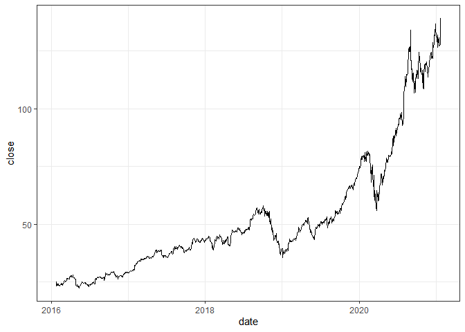

<!-- README.md is generated from README.Rmd. Please edit that file -->

# financeR

<!-- badges: start -->

<!-- badges: end -->

## Pull big amounts of stock and financial data from the ‘financialmodelingprep’ API

A wrapper for pulling stock and financial data from the
‘financialmodelingprep’ API
<https://financialmodelingprep.com/developer/docs/> in bulk.

## Installation

You can install the released version of financeR from
[CRAN](https://CRAN.R-project.org) with:

``` r
install.packages("financeR")
```

And the development version from [GitHub](https://github.com/) with:

``` r
# install.packages("devtools")
devtools::install_github("oliealex/Stock-analysis")
```

Required packages are:

``` r
require(httr) 
require(jsonlite)
```

## Authentication

First, set up an account with <https://financialmodelingprep.com/> and
retrieve your api key, then make sure to set your api key as follwing.

``` r
api <- 'xxxxxxxxxxxxxxxxxxxxxxxxxxxxxxxx'
```

## Example

Do you want to see historical stock data?:

``` r
library(financeR)
api <- "42632c388365783ab0c341411f47ae80"

PLTR <- historic_price(ticker = "PLTR", time = "full", api_key = api)
head(PLTR)
#>         date  open  high   low close adjClose    volume unadjustedVolume change
#> 1 2021-01-22 25.85 32.65 25.82 32.58    32.58 156844666        156844666   6.73
#> 2 2021-01-21 26.42 26.68 25.30 25.98    25.98  29891400         29891400  -0.44
#> 3 2021-01-20 27.29 27.30 25.70 26.34    26.34  37459000         37459000  -0.95
#> 4 2021-01-19 26.81 27.54 26.00 26.62    26.62  48675800         48675800  -0.19
#> 5 2021-01-15 26.26 28.00 25.46 25.64    25.64  92285500         92285500  -0.62
#> 6 2021-01-14 25.45 25.62 24.37 24.92    24.92  32908000         32908000  -0.53
#>   changePercent     vwap          label changeOverTime
#> 1        26.035 30.35000 January 22, 21        0.26035
#> 2        -1.665 25.98667 January 21, 21       -0.01665
#> 3        -3.481 26.44667 January 20, 21       -0.03481
#> 4        -0.709 26.72000 January 19, 21       -0.00709
#> 5        -2.361 26.36667 January 15, 21       -0.02361
#> 6        -2.083 24.97000 January 14, 21       -0.02083
```

Or maybe plot the historical stock prices?:

``` r
library(financeR)
library(lubridate)
library(ggplot2)
api <- "42632c388365783ab0c341411f47ae80"

AAPL <- historic_price(ticker = "AAPL", time = "full", api_key = api)
AAPL$date <- as.Date(AAPL$date)
plot <- ggplot(AAPL, aes(x = date, y = close)) +
  geom_line() +
  theme_bw()
plot
```


